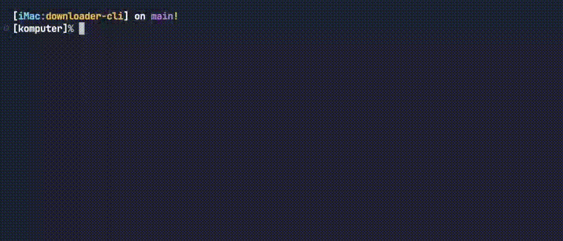
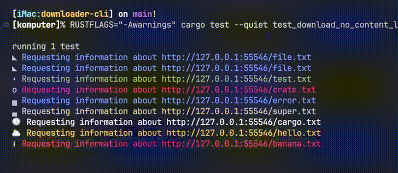

<h1 align="center">
  
  <br/>
  downloader-cli
</h1>

<h3 align="center">⚡ Lightning-fast asynchronous file downloader with customizable progress bars</h3>
<br/>

<div align="center" style="padding-top: 2em !important; padding-bottom: 2em; !important">
    
</div>

<div align="center">
<br/>

[](https://www.rust-lang.org/)
[](https://crates.io/crates/indicatif)
[](LICENSE)


<!-- TODO: after posting on crate.io add a badge
 -->

</div>

<div align="center">
  <a href="#-features">Features</a> •
  <a href="#-installation">Installation</a> •
  <a href="#️-usage">Usage</a> •
  <a href="#️-configuration">Configuration</a> •
  <a href="#-examples">Examples</a> •
  <a href="#-contributing">Contributing</a>
</div>

## 🚀 Features

- **Blazing fast** asynchronous downloads
- **Customizable progress bars** with multiple styles
- **Resume interrupted downloads** *(coming soon)*
- **TOML configuration** for persistent settings
- **Cross-platform** (Windows, macOS, Linux)

## 📦 Installation

<!-- TODO: after posting on crate.io uncomment

### From crates.io

```bash
cargo install downloader-cli
``` -->

### Manual

```bash
git clone https://github.com/fedor81/downloader-cli.git
cd downloader-cli
cargo install --path .
```

## 🖥️ Usage

```bash
downloader-cli [OPTIONS] <SOURCE> [TARGET]
```

### Options

| Option            | Description                            |
| ----------------- | -------------------------------------- |
| `-s --silent`     | Silent mode                            |
| `-r --resume`     | Resume failed download *(coming soon)* |
| `-f --force`      | Overwrite existing files               |
| `--config <FILE>` | Use custom config file                 |
| `-h --help`       | Print help                             |
| `-V --version`    | Print version                          |

## ⚙️ Configuration

Configuration files are searched in these locations:

| Platform        | Paths                                                                         |
| --------------- | ----------------------------------------------------------------------------- |
| **Linux/macOS** | `~/.config/dw.toml`, `~/.config/dw/config.toml`, `~/.dw.toml`, `/etc/dw.toml` |
| **Windows**     | `%APPDATA%\dw.toml`, `%APPDATA%\dw\config.toml`, `%LOCALAPPDATA%\dw.toml`     |

You can redefine the path to the configuration file in the environment variable `DW_CONFIG_PATH`.

### Default configuration

```toml
[general]
log_level = "All"
config_path = ""

[download]
timeout_secs = 30
connect_timeout_secs = 5
retries = 3
parallel_requests = 5
download_dir = ""

[progress_bar]
enable = true
max_displayed_filename = 20
progress_bar_templates = ["[{elapsed_precise}] {msg:20} {bar:40.cyan/blue} {bytes}/{total_bytes} ({eta})"]
progress_bar_chars = ["▓ ░"]
spinner_templates = ["{spinner:.green} [{elapsed_precise}] {msg:20} {bytes} ({bytes_per_sec})"]
spinner_chars = ["⠁⠂⠄⡀⢀⠠⠐⠈⠘⠰⠔⠑⠊ "]
request_spinner_templates = ["{spinner} {msg}"]

[output]
message_on_start = "\nAll files downloaded successfully!"
message_on_errors = ""
message_on_success = ""
message_on_finish = ""
message_on_request = ""
message_on_response = ""
message_on_file_exists = ""
message_on_file_create = ""
message_on_file_size_known = ""
message_on_start_download = ""
```
Progress bars use [Indicatif](https://docs.rs/indicatif) - specify multiple `templates` and `chars` for random selection.

## 🎥 Examples

- The configuration file from the examples below can be found [here](./.github/config.toml).

<div align="center">
    
</div>

- In case a file's size is not available from the server, the progressbar is indefinite.

<div align="center">
    
</div>

## 🤝 Contributing

Check out our [development guide](./.github/CONTRIBUTING.md) for some tips on how to make this project better.


## 📜 License

MIT License - See [LICENSE](./LICENSE) for details.

---

<p align="center">
  <sub>Inspired by <a href="https://github.com/deepjyoti30/downloader-cli">deepjyoti30/downloader-cli</a></sub>
  <br/>
  <sub>Icon by <a href="https://icons8.com">Icons8</a></sub>
</p>